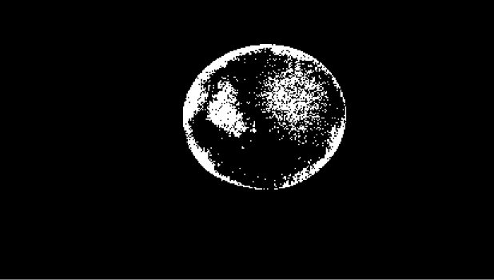
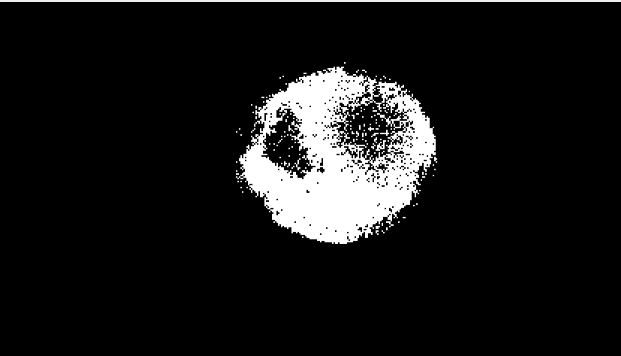
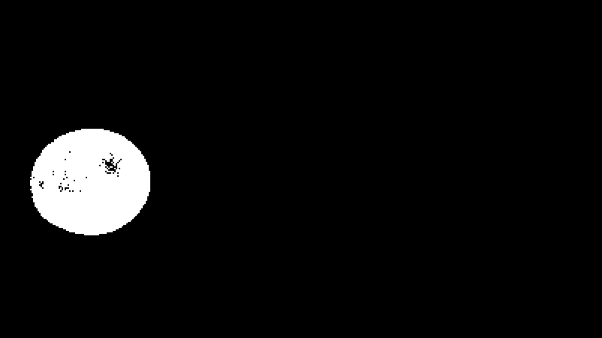
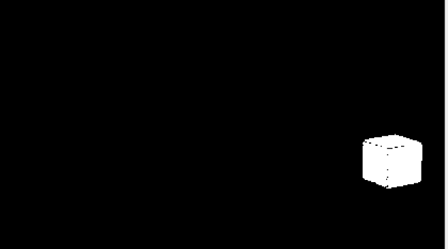
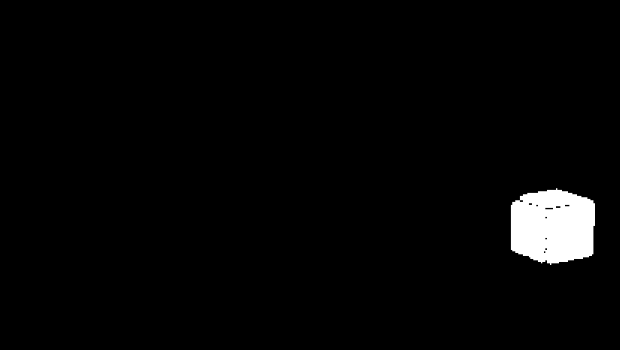

# Vision 1일차 과제 보고서
이름: 김도훈<br>
학번: 2026406041
#
# 빨간색 공 사용한 모폴리지 연산 및 사용한 이유
사용한 모폴로지 연산 : Closing(닫기)<br>

## 빨간색 공 첫 번째 마스크

```cpp
inRange(image3,Scalar(0,100,70), Scalar(10,255,255), mask);
```
<p align="center">
  
</p>

## 빨간색 공 두 번째 마스크
```cpp
inRange(image3, Scalar(170,100,70), Scalar(179,255,255), mask2);
```

<p align="center">
  
</p>

## 첫 번쩨 마스크와 두 번째 마스크 합친 결과
<p align="center">
  
</p>

두개의 이진 마스크를 합친 마스크를 보았을 때 이진 마스크의 검은 색 부분들을 매워주는 닫기(closing)만 사용하여도 빈틈 없는 이진 마스크를 생성할 수 있다.

## 합친 마스크에 닫기(closing)만 실행한 결과
<p align="center">
  
</p>

이렇게 공이 공 형태와 딱 맞게 바이너리 이미지가 잘 만들어진 것을 볼 수 있다. 그래서 본 프로그램에서 빨간색 공에 닫기(closing) 모폴로지 연산을 사용했다.

# 파란색 공 사용한 모폴리지 연산 및 사용한 이유
사용한 모폴로지 연산 : Opening(열기), Closing(닫기)<br> 

 ## 파란색 마스크
 ```cpp
inRange(image3,Scalar(100,100,70), Scalar(110,255,255), mask3);
```
<p align="center">
  
</p>

## 파란색 마스크 열기(opening) 결과
<p align="center">
  
</p>

## 파란색 마스크 닫기(closing) 결과
<p align="center">
  
</p>

## 두 개의 마스크를 합친 결과
<p align="center">
  
</p>

## 
파란색 공의 이진 마스크를 봤을 때 객체 내부에 끊어진 부분이 그 부분을 채우는 데 효과적인 닫기 연산만으로도 충분히 파란색 공과 비슷한 형태를 만들 수 있었다. 하지만 아주 작은 노이즈가 존재할 수 있고 그 노이즈를 그 노이즈를 제거하기 위해 노이즈 제거에 효과적인 열기 연산도 같이 사용하였다.  


## 초록색 공 사용한 모폴리지 연산 및 사용한 이유
사용한 모폴로지 연산 : Opening(열기), Closing(닫기)<br> 

 ## 초록색 마스크
 ```cpp
inRange(image3,Scalar(50,100,30), Scalar(70,255,255), mask4);
```
<p align="center">
  
</p>

## 초록색 마스크 열기(opening) 결과
<p align="center">
  
</p>

## 초록색 마스크 닫기(closing) 결과
<p align="center">
  
</p>

## 두 개의 마스크를 합친 결과
<p align="center">
  
</p>

##
초록색 또한 이진 마스크를 생성했을 때 닫기 연산만 진행하여도 초록색 정육면체와 비슷한 객체를 얻을 수 있었다. 파란색 공의 이진 마스크를 생성할 때 아주 작은 노이즈를 제거하기 위해 열기 연산을 진행하였다.
